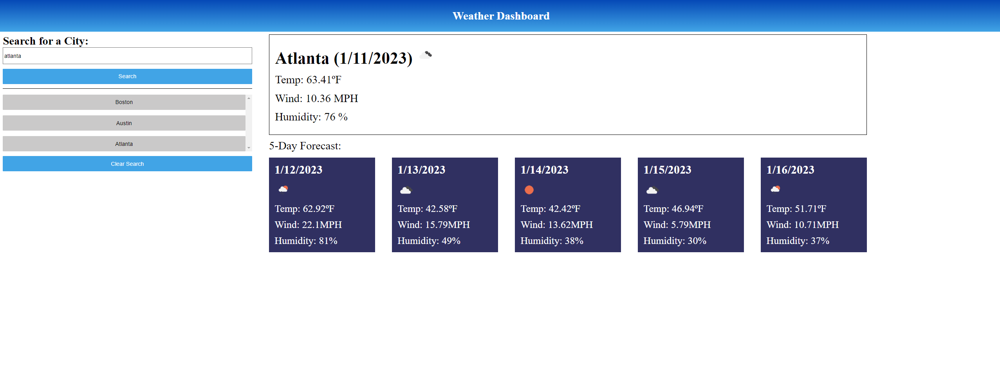

# Weather Dashboard ReadMe

## Purpose
 To create an app that displays the current weather data for a searched city and to provide the user a forecast for the next 5 days.

## user Story
````
As a user, that is interested in weather data, I want to be able to search for a city.
When searched I want to see the weather for current day and teh next 5 days.
I want to keep a list of saved searched.
When saved search is clicked.
The corresponding data should reappear.
````
## Site Preview
 

## site links
- code: https://github.com/waustin45/weather-api-app.git
- site: https://waustin45.github.io/weather-api-app/


